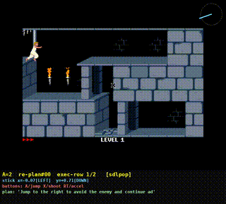

# NitroGen-With-VLM-Planning

A research fork adding a **VLM planner (System 2)** on top of NVIDIA's
[NitroGen](https://github.com/MineDojo/NitroGen) — a 500M-param flow-matching DiT that
maps the current frame to gamepad actions (a fast-reacting *System 1*).

> Upstream NitroGen sees only the **last frame**, so it cannot plan over long horizons.
> This fork adds a frozen **Qwen3.5-0.8B planner** that reads a plan and steers NitroGen's
> actions via injected **plan tokens** — a System-2 → System-1 hierarchy.

The original upstream README is preserved at
[`README_UPSTREAM.md`](README_UPSTREAM.md). This is a research fork, **not** an official
NVIDIA or upstream product.

---

## What this fork adds

A frozen VLM reads a plan (Stage-1: synthetic; Stage-2: transcript-derived) and produces
hidden states. A learned **Perceiver resampler** distills them into **K plan tokens**, a
per-token **adapter** maps them into NitroGen's vision space, and they are injected into
the DiT's vision–language cross-attention. A **masked-null** mode makes a null plan
reproduce the base model exactly (so CFG-style plan guidance works).

Stage-1 alignment is trained from synthetic plans (counterfactual action chunks) with no
game execution; the DiT can stay frozen for coarse control, with optional LoRA for
fine-grained routing — a convenient property of the synthetic stage, not a design
constraint (DiT fine-tuning is expected for later stages).

```
plan text + frames ─▶ frozen Qwen3.5-0.8B ─▶ resampler (K queries) ─▶ adapter ─▶ K plan tokens
                                                                                      │ inject
 frame ─────────────────────────────────────────────────────────────────────────────▼
                      NitroGen DiT (frozen) :  action tokens cross-attend to [image | plan tokens]
                                            ─▶ 18-step action chunk
```

See [`docs/DATAFLOW.md`](docs/DATAFLOW.md) for the exact module/tensor path,
[`docs/INDEX.md`](docs/INDEX.md) for a capability → experiment → checkpoint map, and
[`AGENTS.md`](AGENTS.md) for the **start-here handoff** (task state, run commands, what's next).
Per-checkpoint training detail is in [`docs/CHECKPOINTS.md`](docs/CHECKPOINTS.md).

### Demo — plan-conditioned rollout



The planner re-plans every A=2 chunks ("Jump to the right to avoid the enemy and continue…") and the
plan token steers the frozen DiT's actions; the overlay shows the live plan + the executed
stick/buttons. More annotated rollouts in [`docs/horizon_play_grounded/`](docs/horizon_play_grounded)
(STK, SDLPoP, Solarus, TheXTech at A=2 and A=4).

## Capabilities demonstrated (Stage-1, frozen base)

| Capability | Result | Where |
|---|---|---|
| **Direction steering** ("go left") + exact null-invariance | cos(L,R) 0.999→0.10, null-inv 0.000 | EXP-009/010 |
| **Within-chunk ordering** (SEQ: "left then right") | SEQ2/SEQ3 solved; SEQ4 generalizes zero-shot | EXP-016/017/018 |
| **Heterogeneous** sequencing ("left then jump") | strong localized button presses (via LoRA) | EXP-021/022 |
| **Uneven-duration** plans ("briefly left, then right") | content-driven transition timing | EXP-023/024 |
| **Cross-chunk** (one plan spans A chunks, cursor-selected) | 16/16, scales to A=4 | EXP-027/028/030 |
| **Nested** (cross-chunk + within-chunk ordering) | 24/24 + holds retained | EXP-029 |
| **R0 post-hoc** (real action targets; plan overrides the frame) | 16/16 causal on real episodes | EXP-031 |

**Finding:** direction + ordering already work on a **frozen DiT** (the representation and
contrastive loss are the lever); *fine* cross-modal/temporal routing (a specific button in
a specific half, exact transition timing) is where DiT capacity via **LoRA** helps.

Full experiment log: [`EXPERIMENTS.md`](EXPERIMENTS.md) (EXP-000..049b, 0.8B era); the 2B Stage-2
checkpoints are detailed in [`docs/CHECKPOINTS.md`](docs/CHECKPOINTS.md).

## Repository layout (fork additions)

```
nitrogen/planner.py                         # PlanEncoder / PlanResampler / PlanAdapter / PlanHead
nitrogen/flow_matching_transformer/
    nitrogen.py                             # plan injection, masked-null, order-aware contrastive
    lora.py                                 # LoRA on the DiT cross-attention
nitrogen/training/{plans,dataset,actions,video}.py   # synthetic + cross-chunk plans, data pipeline
nitrogen/eval/envs/                         # 38 game envs: proc/Xvfb + in-process emulators (save/load)
scripts/train_planner.py                    # Stage-1 alignment trainer
scripts/{extract_cc_frames,download_more_videos}.py  # frame/data tooling
planner_poc/                                # behavioral evals + probes; record server; data tooling
    record_play_server.py                   #   browser play-and-record (human gold trajectories)
    env_healthcheck.py  run_poc.py          #   boot-test + env factory
    yt_farm.py  objective_label_demo.py     #   YouTube farming + VLM objective labels (data bootstrap)
    idm_gen_emulator_data.py                #   emulator ground-truth (frame, action) for an IDM
docs/{DATAFLOW,INDEX,CHECKPOINTS,SETUP_EVAL}.md      # architecture + navigation + setup
AGENTS.md  DESIGN.md  MULTICHUNK_DESIGN.md  LITERATURE.md  EXPERIMENTS.md
```

## Setup

Same base install as upstream, plus the planner backbone:

```bash
pip install -e .
hf download nvidia/NitroGen ng.pt              # base DiT  -> ckpts/nitrogen/ng.pt
hf download Qwen/Qwen3.5-0.8B                   # planner   -> ckpts/qwen35-0.8b
```

The `nvidia/NitroGen` dataset ships **action labels only**; frames are fetched from the
source videos (see [`docs/SETUP_YOUTUBE.md`](docs/SETUP_YOUTUBE.md) for the cookies +
PO-token + Deno ingestion recipe).

## Train (Stage-1 alignment)

Example — direction steering + within-chunk ordering, frozen DiT:

```bash
python scripts/train_planner.py \
  --ng-ckpt ckpts/nitrogen/ng.pt --qwen ckpts/qwen35-0.8b \
  --shard-root <chunks_dir> --frames-dir <frames_dir> \
  --null-mode masked --freeze-dit --seq-heavy \
  --contrastive-weight 1.0 --contrastive-mode pertoken \
  --plan-ratio 0.6 --lr-plan 3e-4
```

Useful flags: `--num-chunks A --cross-chunk` (long-horizon cursor), `--lora-dit 16`
(fine button/timing routing), `--resampler-self-attn` (Q-former toggle),
`--cc-pool {hold,nested,hold4}`, `--cc-posthoc` (real-action-target R0).

## Eval environments & gold-data recording

A headless eval harness runs **38 games** under Xvfb (30 boot cleanly; `run_poc.list_envs()`), driven
via synthetic keyboard/gamepad input. It includes **in-process emulator envs** (mGBA for GB/GBC/GBA,
stable-retro for SNES) with **frame-exact save/load** — the substrate for save-state RL. Ground-truth
state for the native FOSS games (TheXTech, Solarus) is read **without any source fork** (TheXTech via
`/proc/<pid>/mem` on a stock debug-symbol build; Solarus via an auto-applied quest overlay).

A **browser play-and-record server** lets you collect human gold trajectories on a remote/headless box:

```bash
python planner_poc/record_play_server.py --env thextech_get_flower --port 8123
# forward port 8123 to your laptop and open it; play with your keyboard. STEP mode is lag-immune
# (game-time is locked to delivered frames). Recordings -> docs/recordings/<env>_<ts>/.
```

See [`docs/SETUP_EVAL.md`](docs/SETUP_EVAL.md) for the full setup (apt packages, `pip install -e
".[eval]"`, deno for YouTube, emulator backends) and [`AGENTS.md`](AGENTS.md) §3B/§5 for details.

## Status & next directions

- **Stage-1** (synthetic-plan alignment) is **working** across the capabilities above (frozen 0.8B
  backbone era; full log EXP-000..049b in `EXPERIMENTS.md`).
- **Stage-2, 2B backbone** (the released `stage2_2b_*` checkpoints — see
  [`docs/CHECKPOINTS.md`](docs/CHECKPOINTS.md)): the resampler/adapter moved to the backbone's native
  2048-dim. Achieved combined **direction + 5/5 button steering** (`btn_s600`), and **recovered env-free
  left/right** by cleaning contrastive label noise (`clean_s2000`: token sep 0.50→0.688). Diagnosis
  localized the left/right loss to the PlanAdapter, not the VLM.
- **Data bootstrapping** (the path forward, scaffolded): popular-game ROMs + YouTube longplays + a
  VPT-style IDM. The frozen VLM emits grounded **objectives for free** on frames; the **emulator**
  supplies ground-truth actions to train an IDM that then pseudo-labels YouTube at scale; emulator
  **save-states verify counterfactuals** (dense reward → RL). See `AGENTS.md §3C` + `LITERATURE.md §E`.
- Long-horizon **counterfactual** play is expected to need a game environment: no reusable world model
  was found in NitroGen's DiT internals (EXP-034), so counterfactual futures can't be manufactured
  purely offline — hence the emulator/RL substrate above.

> Sidenote: Stage-1 happens to be fully **env-free** (synthetic plans, no game rollouts)
> and **parameter-efficient** (frozen base, optional LoRA). These are conveniences of the
> synthetic alignment stage, not goals of the method — later stages fine-tune the DiT
> (LoRA) and use a live environment (emulators).

## Citation

This fork builds directly on NitroGen — please cite the upstream paper (bibtex in
[`README_UPSTREAM.md`](README_UPSTREAM.md)).

**Disclaimer:** Research project, strictly for research purposes. Not an official NVIDIA
or upstream product.
