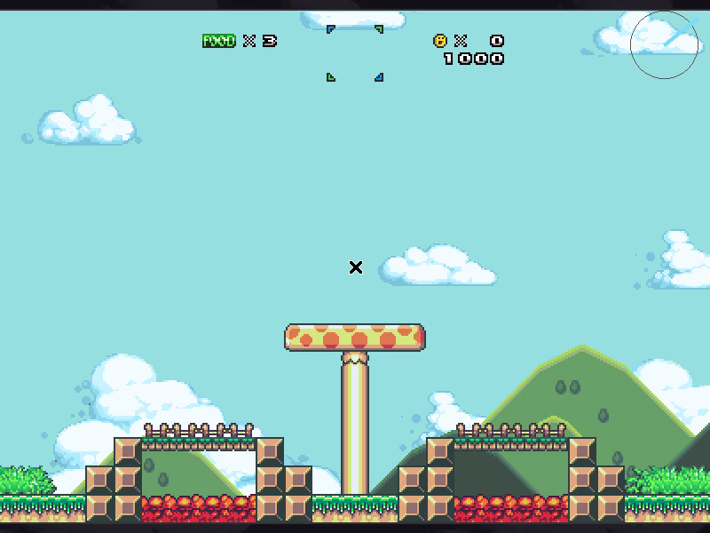
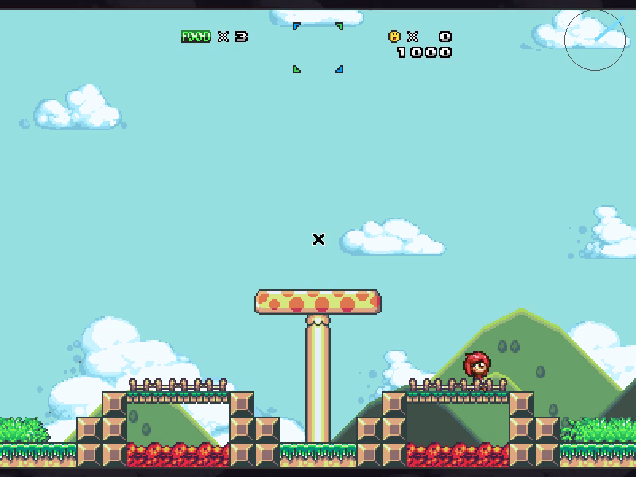
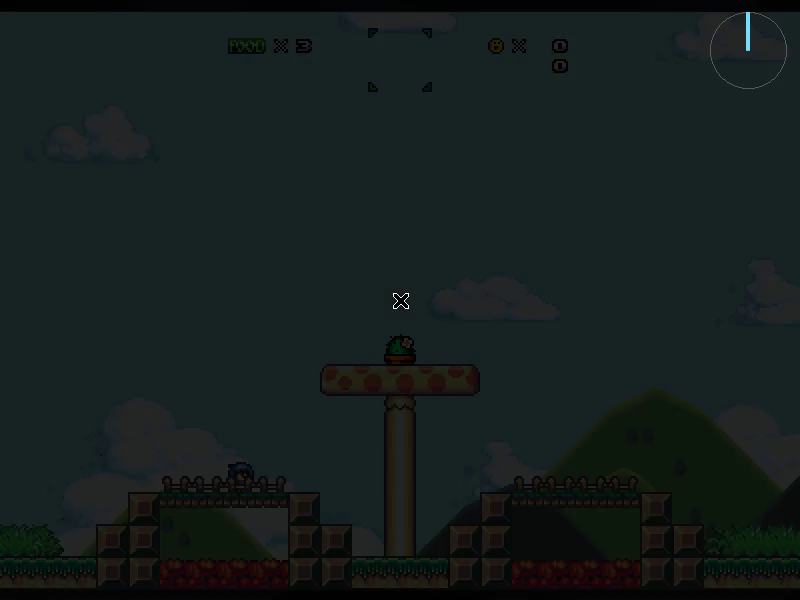
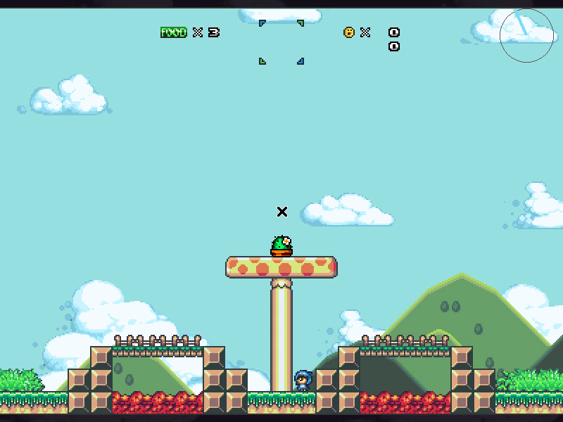
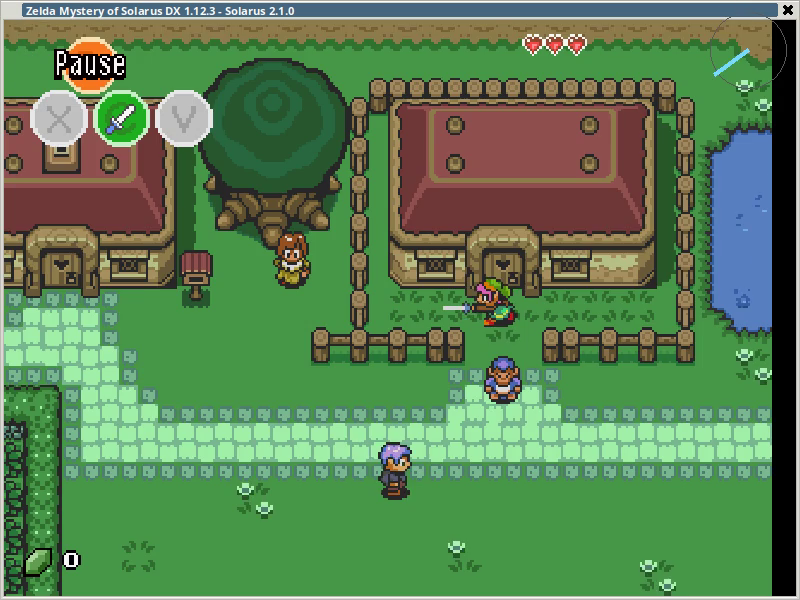
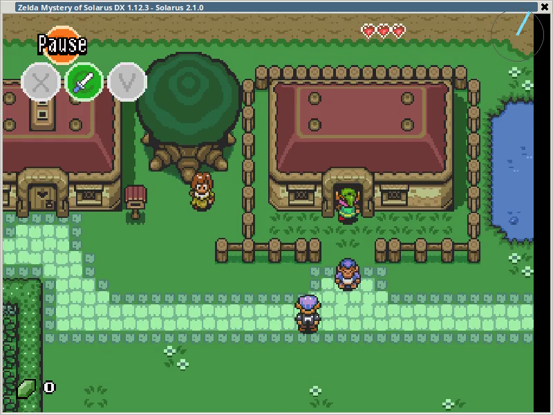
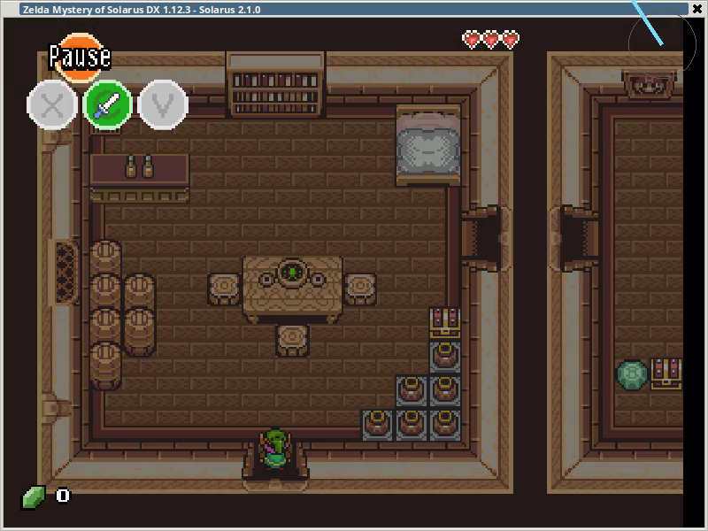
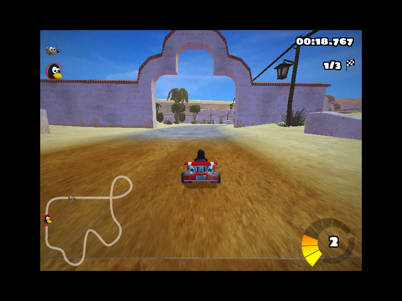
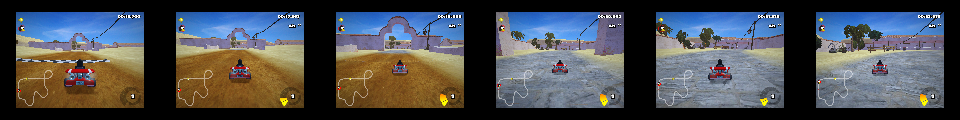

# Prompt-format ablation — frozen Qwen3.5-2B planner

How far does **pure prompting / input-format** (no training) get the System-2 planner on real game frames? Each scenario below shows the **input frames**, then for five prompt configs the **exact system prompt**, the **instruction**, and the **model's output**.

Knobs: **+controls** (tell it the control scheme) · **+history** (dump the agent's OWN actions taken between the frames — no privileged game state) · **+grounded** (nudge it to use concrete control/game-specific terms so the direction is unambiguous, e.g. "move RIGHT" instead of "move forward").

_Generated by `planner_poc/gen_prompt_bench_md.py` (frames in `frames/`)._

---

## platformer_progress  ·  _platformer, 3 frames, type=normal_

> The hero is advancing right and jumping onto ledges — things are going well.

  

**Action-history dump** (used by +history / +all): `Actions taken between these frames: moved RIGHT for 12 of the last 18 steps, JUMP 6 times.`

### C0 — base (no extras)

- **System:** You are the high-level planner for an agent playing a 2D video game. You see the most recent frames (oldest first). Decide the single best next move.
- **Instruction:** What should the agent do next?
- **Output:** `Based on the visual sequence, the agent is in a high-risk situation. ⏎  ⏎ - **Initial State:** The agent is on a safe platform, but the environment is dark and the sky is darkening, indicating an impending or ongoing event.`

### C1 — +controls (control scheme in system prompt)

- **System:** You are the high-level planner for an agent playing a 2D video game. You see the most recent frames (oldest first). Decide the single best next move. Controls: move LEFT or RIGHT, look UP, crouch DOWN, JUMP, and ATTACK. To reach a higher ledge you must JUMP (moving sideways alone will not climb).
- **Instruction:** What should the agent do next?
- **Output:** `Based on the sequence of images, here is the analysis of the situation and the best next move: ⏎  ⏎ - **Initial State (Image 1):** The player is on a lower platform. There is a high platform in the center, and`

### C2 — +history (dump of the agent's own actions between frames)

- **System:** You are the high-level planner for an agent playing a 2D video game. You see the most recent frames (oldest first). Decide the single best next move.
- **Instruction:** Actions taken between these frames: moved RIGHT for 12 of the last 18 steps, JUMP 6 times. ⏎  ⏎ Given that, what should the agent do next?
- **Output:** `Based on the visual evidence, the agent has successfully navigated the platforming section. ⏎  ⏎ - The first two frames show the agent moving across the level. ⏎ - The third frame shows the agent at the top of the central pillar, having`

### C3 — +grounded (use concrete control terms, not vague 'forward'/'explore')

- **System:** You are the high-level planner for an agent playing a 2D video game. You see the most recent frames (oldest first). Decide the single best next move.
- **Instruction:** What should the agent do next? Give just your one-sentence recommendation for what the agent should broadly do next (no frame-by-frame description). Use concrete control or game-specific terms so the direction is clear -- e.g. 'move RIGHT', 'go UP', 'JUMP', 'ATTACK' -- not vague words like 'forward' or 'explore'.
- **Output:** `go UP`

### C4 — +all (controls + history + grounded)

- **System:** You are the high-level planner for an agent playing a 2D video game. You see the most recent frames (oldest first). Decide the single best next move. Controls: move LEFT or RIGHT, look UP, crouch DOWN, JUMP, and ATTACK. To reach a higher ledge you must JUMP (moving sideways alone will not climb).
- **Instruction:** Actions taken between these frames: moved RIGHT for 12 of the last 18 steps, JUMP 6 times. ⏎  ⏎ Given that, what should the agent do next? Give just your one-sentence recommendation for what the agent should broadly do next (no frame-by-frame description). Use concrete control or game-specific terms so the direction is clear -- e.g. 'move RIGHT', 'go UP', 'JUMP', 'ATTACK' -- not vague words like 'forward' or 'explore'.
- **Output:** `go UP`

---

## platformer_BLOCKED  ·  _platformer, 3 frames, type=blocked_

> REAL stuck moment (from the thextech rollout, state-verified): the hero is jammed at the base of the central pillar — it held RIGHT but its x-position stayed frozen at 424. To get onto the platform it must JUMP, not keep pushing RIGHT.

  

**Action-history dump** (used by +history / +all): `Actions taken between these frames: held RIGHT for most of the last 18 steps. The frames look the same -- the character has not moved.`

### C0 — base (no extras)

- **System:** You are the high-level planner for an agent playing a 2D video game. You see the most recent frames (oldest first). Decide the single best next move.
- **Instruction:** What should the agent do next?
- **Output:** `Based on the visual information from the three frames, here is the analysis of the situation: ⏎  ⏎ -   **Current State:** The agent (a blue character) is standing on the ground level, directly below a high platform. On this platform`

### C1 — +controls (control scheme in system prompt)

- **System:** You are the high-level planner for an agent playing a 2D video game. You see the most recent frames (oldest first). Decide the single best next move. Controls: move LEFT or RIGHT, look UP, crouch DOWN, JUMP, and ATTACK. To reach a higher ledge you must JUMP (moving sideways alone will not climb).
- **Instruction:** What should the agent do next?
- **Output:** `Based on the provided screenshots, the agent is in a precarious position. The character is standing on a low platform, and there is a high platform with a green character on top, separated by a significant vertical distance. ⏎  ⏎ - The character is`

### C2 — +history (dump of the agent's own actions between frames)

- **System:** You are the high-level planner for an agent playing a 2D video game. You see the most recent frames (oldest first). Decide the single best next move.
- **Instruction:** Actions taken between these frames: held RIGHT for most of the last 18 steps. The frames look the same -- the character has not moved. ⏎  ⏎ Given that, what should the agent do next?
- **Output:** `Based on the visual evidence, the agent's current state is static. The character remains in the exact same position, and the environment has not changed. The action of "held RIGHT" has been executed for 18 steps without any observable`

### C3 — +grounded (use concrete control terms, not vague 'forward'/'explore')

- **System:** You are the high-level planner for an agent playing a 2D video game. You see the most recent frames (oldest first). Decide the single best next move.
- **Instruction:** What should the agent do next? Give just your one-sentence recommendation for what the agent should broadly do next (no frame-by-frame description). Use concrete control or game-specific terms so the direction is clear -- e.g. 'move RIGHT', 'go UP', 'JUMP', 'ATTACK' -- not vague words like 'forward' or 'explore'.
- **Output:** `JUMP`

### C4 — +all (controls + history + grounded)

- **System:** You are the high-level planner for an agent playing a 2D video game. You see the most recent frames (oldest first). Decide the single best next move. Controls: move LEFT or RIGHT, look UP, crouch DOWN, JUMP, and ATTACK. To reach a higher ledge you must JUMP (moving sideways alone will not climb).
- **Instruction:** Actions taken between these frames: held RIGHT for most of the last 18 steps. The frames look the same -- the character has not moved. ⏎  ⏎ Given that, what should the agent do next? Give just your one-sentence recommendation for what the agent should broadly do next (no frame-by-frame description). Use concrete control or game-specific terms so the direction is clear -- e.g. 'move RIGHT', 'go UP', 'JUMP', 'ATTACK' -- not vague words like 'forward' or 'explore'.
- **Output:** `go UP`

---

## topdown_BLOCKED  ·  _topdown, 3 frames, type=blocked_

> The hero held DOWN into a wall and isn't progressing — it should try another direction.

  

**Action-history dump** (used by +history / +all): `Actions taken between these frames: held DOWN for 15 of the last 18 steps.`

### C0 — base (no extras)

- **System:** You are the high-level planner for an agent playing a 2D video game. You see the most recent frames (oldest first). Decide the single best next move.
- **Instruction:** What should the agent do next?
- **Output:** `Based on the sequence of images, here is the logical breakdown of the situation: ⏎  ⏎ - **Initial State (Image 1):** The player is in a village area. A character with green hair and a sword is standing near a large house`

### C1 — +controls (control scheme in system prompt)

- **System:** You are the high-level planner for an agent playing a 2D video game. You see the most recent frames (oldest first). Decide the single best next move. Controls: move LEFT, RIGHT, UP or DOWN, SWORD to attack, ACTION to interact.
- **Instruction:** What should the agent do next?
- **Output:** `Based on the sequence of images, here is the logical breakdown of the situation: ⏎  ⏎ - **Initial State (Image 1):** The player is in an outdoor area. A character with green hair and a sword is standing near a house.`

### C2 — +history (dump of the agent's own actions between frames)

- **System:** You are the high-level planner for an agent playing a 2D video game. You see the most recent frames (oldest first). Decide the single best next move.
- **Instruction:** Actions taken between these frames: held DOWN for 15 of the last 18 steps. ⏎  ⏎ Given that, what should the agent do next?
- **Output:** `Based on the visual evidence, the agent's previous action of holding DOWN was successful. ⏎  ⏎ - The first two frames show the character standing in the yard. ⏎ - The third frame shows the character now inside a building, specifically in what appears`

### C3 — +grounded (use concrete control terms, not vague 'forward'/'explore')

- **System:** You are the high-level planner for an agent playing a 2D video game. You see the most recent frames (oldest first). Decide the single best next move.
- **Instruction:** What should the agent do next? Give just your one-sentence recommendation for what the agent should broadly do next (no frame-by-frame description). Use concrete control or game-specific terms so the direction is clear -- e.g. 'move RIGHT', 'go UP', 'JUMP', 'ATTACK' -- not vague words like 'forward' or 'explore'.
- **Output:** `Move RIGHT`

### C4 — +all (controls + history + grounded)

- **System:** You are the high-level planner for an agent playing a 2D video game. You see the most recent frames (oldest first). Decide the single best next move. Controls: move LEFT, RIGHT, UP or DOWN, SWORD to attack, ACTION to interact.
- **Instruction:** Actions taken between these frames: held DOWN for 15 of the last 18 steps. ⏎  ⏎ Given that, what should the agent do next? Give just your one-sentence recommendation for what the agent should broadly do next (no frame-by-frame description). Use concrete control or game-specific terms so the direction is clear -- e.g. 'move RIGHT', 'go UP', 'JUMP', 'ATTACK' -- not vague words like 'forward' or 'explore'.
- **Output:** `go UP`

---

## racing_STRAIGHT  ·  _racing, 2 frames, type=normal_

> The kart is centred on a straight, doing well — the move is to keep going (ACCELERATE), and a good plan should say so concretely.

 

**Action-history dump** (used by +history / +all): `Actions taken between these frames: ACCELERATE every step, steering near-centre.`

### C0 — base (no extras)

- **System:** You are the high-level planner for an agent playing a 2D video game. You see the most recent frames (oldest first). Decide the single best next move.
- **Instruction:** What should the agent do next?
- **Output:** `Of course. ⏎  The analysis of the provided frames indicates that the agent is in a critical situation. ⏎  Here is a logical breakdown of the situation and the recommended action: ⏎ - **Current State:** The agent is driving a kart on a`

### C1 — +controls (control scheme in system prompt)

- **System:** You are the high-level planner for an agent playing a 2D video game. You see the most recent frames (oldest first). Decide the single best next move. Controls: steer LEFT or RIGHT, ACCELERATE, BRAKE.
- **Instruction:** What should the agent do next?
- **Output:** `Of course. ⏎  The analysis of the provided frames indicates that the agent is in a critical situation. ⏎  Here is a more detailed breakdown of the situation and the recommended action. ⏎   ⏎ ### Situation Analysis ⏎ - **Current State:** The agent`

### C2 — +history (dump of the agent's own actions between frames)

- **System:** You are the high-level planner for an agent playing a 2D video game. You see the most recent frames (oldest first). Decide the single best next move.
- **Instruction:** Actions taken between these frames: ACCELERATE every step, steering near-centre. ⏎  ⏎ Given that, what should the agent do next?
- **Output:** `Of course. ⏎  Let's break down the situation and decide on the best next move. ⏎  ⏎ ### Analysis of the Current State ⏎ - **Game State:** The agent is in a kart racing game, currently in 3rd place (`

### C3 — +grounded (use concrete control terms, not vague 'forward'/'explore')

- **System:** You are the high-level planner for an agent playing a 2D video game. You see the most recent frames (oldest first). Decide the single best next move.
- **Instruction:** What should the agent do next? Give just your one-sentence recommendation for what the agent should broadly do next (no frame-by-frame description). Use concrete control or game-specific terms so the direction is clear -- e.g. 'move RIGHT', 'go UP', 'JUMP', 'ATTACK' -- not vague words like 'forward' or 'explore'.
- **Output:** `The agent should move RIGHT.`

### C4 — +all (controls + history + grounded)

- **System:** You are the high-level planner for an agent playing a 2D video game. You see the most recent frames (oldest first). Decide the single best next move. Controls: steer LEFT or RIGHT, ACCELERATE, BRAKE.
- **Instruction:** Actions taken between these frames: ACCELERATE every step, steering near-centre. ⏎  ⏎ Given that, what should the agent do next? Give just your one-sentence recommendation for what the agent should broadly do next (no frame-by-frame description). Use concrete control or game-specific terms so the direction is clear -- e.g. 'move RIGHT', 'go UP', 'JUMP', 'ATTACK' -- not vague words like 'forward' or 'explore'.
- **Output:** `move LEFT`

---

